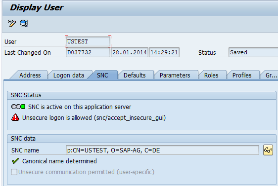
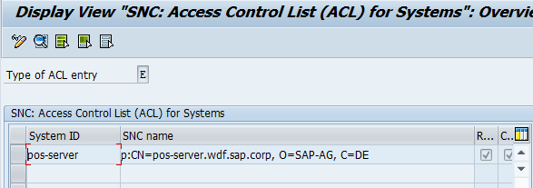

SAP NW RFC Library supports plain and secure connection with following authentication methods:

- [Plain with username/password](#plain-with-usernamepassword)
- [WebSocket RFC](#websocket-rfc)
- [SNC with user PSE](#snc-with-user-pse)
  - [Prerequisites](#prerequisites)
- [SNC with client system PSE and User X509](#snc-with-client-system-pse-and-user-x509)

NW ABAP servers support in addition:

- SAP logon tickets
- Security Assertion Markup Language (SAML)

Assuming you are familiar with abovementioned concepts and have ABAP backend system configured for SNC communication, here you may find connection strings examples, for testing plain and secure RFC connections, with various authentication methods.

## Plain with username/password

The simplest and the least secure form of the user authentication:

```ini
USER=demo
PASSWD=welcome
ASHOST=10.68.110.51
SYSNR=00
CLIENT=620
LANG=EN
```

## WebSocket RFC

Preferred way on newer systems. See also:

- https://github.com/SAP/node-rfc/issues/212
- Section 4 of `sapnwrfc.ini` in SAP NWRFC SDK demo folder

Authentication with user/password:

```ini
DEFAULT
TLS_SAPCRYPTOLIB=/usr/local/sap/cryptolib/libsapcrypto.so

DEST=WS_ALX
WSHOST=ldcialx.wdf.sap.corp
WSPORT=44318
USER=wstest
PASSWD=wstest
CLIENT=000
LANG=EN
TLS_CLIENT_PSE=/Users/rfctest/sec/rfctest.pse
```

Authentication with client certificate

```ini
DEFAULT
TLS_SAPCRYPTOLIB=/usr/local/sap/cryptolib/libsapcrypto.so

DEST=WS_ALX_CC
TLS_CLIENT_CERTIFICATE_LOGON=1
WSHOST=ldcialx.wdf.sap.corp
WSPORT=44318
CLIENT=000
LANG=EN
TLS_CLIENT_PSE=/Users/rfctest/sec/rfctest.pse
```

The path to crypto library can be also set by `loadCryptoLibrary` method, available from `node-rfc` 2.4.3:

```js
const noderfc = require("node-rfc");

noderfc.loadCryptoLibrary("/usr/local/sap/cryptolib/libsapcrypto.so")
```

This API cannot reset a new path to the library during runtime. Once set, the path is definitive.

## SNC with user PSE

User PSE is used for opening the SNC connection and the same PSE is used for the authentication (logon) in NW ABAP backend.

Generally not recomended, see SAP Note [1028503 - SNC-secured RFC connection: Logon ticket is ignored](https://launchpad.support.sap.com/#/notes/1028503)

```ini
SNC_LIB=C:\Program Files\SAP\FrontEnd\SecureLogin\libsapcrypto.dll
SNC_PARTNERNAME=p/secude:CN=QM7, O=SAP-AG, C=DE
ASHOST=ldciqm7.wdf.sap.corp
SYSNR=20
CLIENT=715
```

In this example the `SNC_LIB` key contains the path to security library (SAP cryptographic library or 3rd party product).

Alternatively, the path can be set as `SNC_LIB` environment variable, in which case it does not have to be provided as a connection parameter.

### Prerequisites

- SAP Single Sign On must be configured on a client and the user must be logged in on a client.
- SNC name must be configured for the ABAP user in NW ABAP system, using transaction SU01:
   

## SNC with client system PSE and User X509

The client system PSE is used for opening SNC connection and user X509 certificate is forwarded to ABAP backend system, for authentication and logon.

Connection parameters are the same as in a previous example, with user X509 certificate added:

```ini
SNC_LIB=C:\Program Files\SAP\FrontEnd\SecureLogin\libsapcrypto.dll
SNC_PARTNERNAME=p/secude:CN=QM7, O=SAP-AG, C=DE
X509CERT=MIIDJjCCAtCgAwIBAgIBNzA ... NgalgcTJf3iUjZ1e5Iv5PLKO
ASHOST=ldciqm7.wdf.sap.corp
SYSNR=20
CLIENT=715
```

**Prerequisites**

- The user does not have to be logged into the client system, neither the Single Sign On must be configured on a client
- The trusted relationship must be established between the ABAP backend system and the client system.
- The client system must be registered in the NW ABAP backend Access Control List (ACL), using transaction SNC0
- Keystores are generated on a client system, using SAP cryptography tool SAPGENPSE and the environment variable SECUDIR points to the folder with generated keystores

    

- User X509 certificate must be mapped to ABAP NW backend user, using transaction EXTID_DN
    

    
