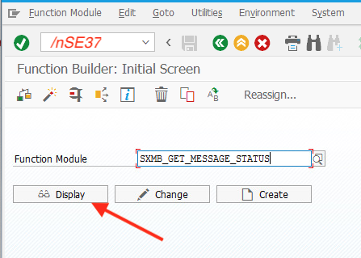
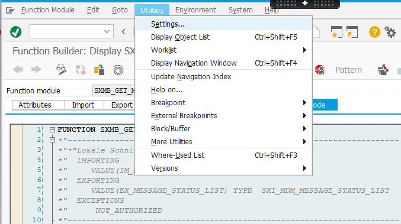
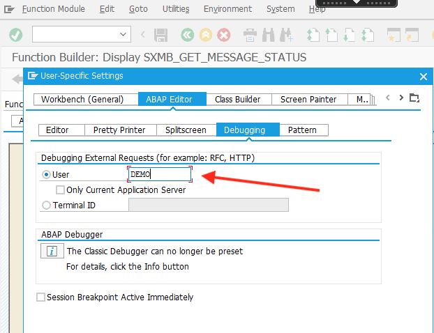
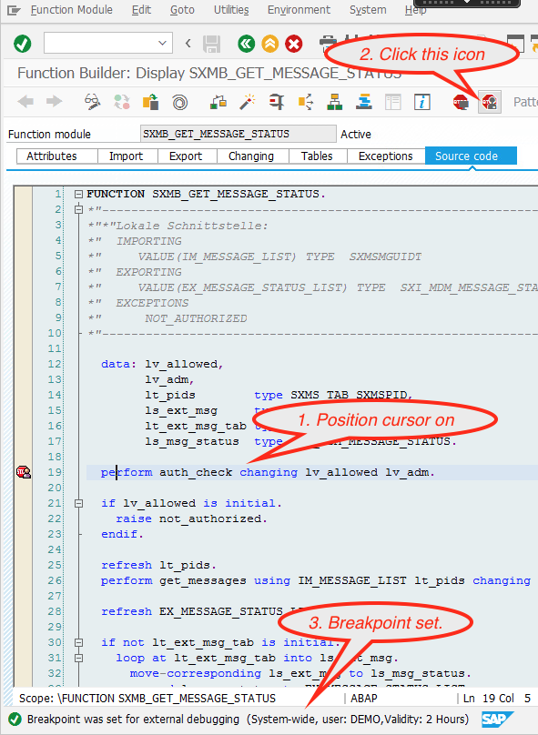

# RFC call results differ from expected

ABAP function module results can be different when invoked via transaction SE37 in ABAP system
and via `node-rfc` connector, with exactly the same input parameters. Typically:

1. Leading zeros are not shown in SE37, but sent to NodeJS when remote FM is called from NodeJS.

2. The function module returns the data in SE37 and does not find any data when exactly the same input key is sent from NodeJS, let say `{PARTNER_ID: '4711'}`

3. Other than expected date returned to NodeJS from ABAP

The cause can be a bug in `node-rfc` package or in `SAP NWRFC SDK`, but less likely.
The problem is usually caused by not respecting the technical restriction of SAP NWRFC protocol,
described here: https://www.sapinsideronline.com/articles/bapi-conversion-issues/.

In short, so called Conversion Exits ("ALPHA" Exits) may be attached to certain fields of ABAP RFM paramereters,
providing automatic conversions of data (e.g. leading zeroes removal) when data sent to the client and when
the data sent from client to ABAP system (e.g. add leading zeroes). Conversion Exits help clients work with more
convenient data representation, like 4711, rather than 000000004711 for example.

Conversion ("ALPHA") exists are triggered in SAP GUI and in SE37 but not when
the ABAP FM is called via SAP RFC protocol, therefore the rectifying logic shall be
implemented in the FM or in RFC enabled FM wrapper. The behaviour can be also caised by different authorization levels, when ABAP FM is invoked
locally or remotely, via SAP RFC protocol.

Another root cause can be internal caching implemented in some ABAP FMs, causing different results even in ABAP, depnding on call sequence for example.

Please check possibilities, before reporting the problem with `node-rfc` connector.

# Remote ABAP debugging

Remote ABAP debugging can be very helpful in troubleshooting NodeJS/ABAP integration issues.
SAPGUI access to ABAP system is reguired.

-   Start the SE37 transaction and set the so called "external breakpoint" in ABAP source code, for ABAP user, used in NodeJS application.

    

    Open Settings and set the external debugging user to one used in node-rfc connection
    

    

    

*   Run NodeJS script

*   After ABAP RFM invocation from NodeJS, the ABAP debugger shows up in ABAP system, stopped at external breakpoint.

At this point, the data coming from NodeJS to ABAP can be inspected, catching suspected node-rfc conversion bug.
